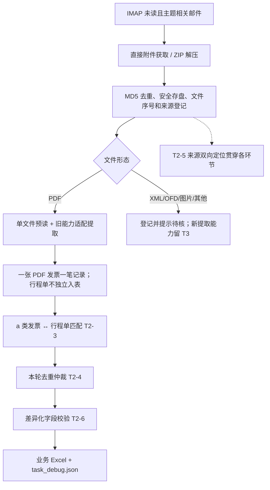
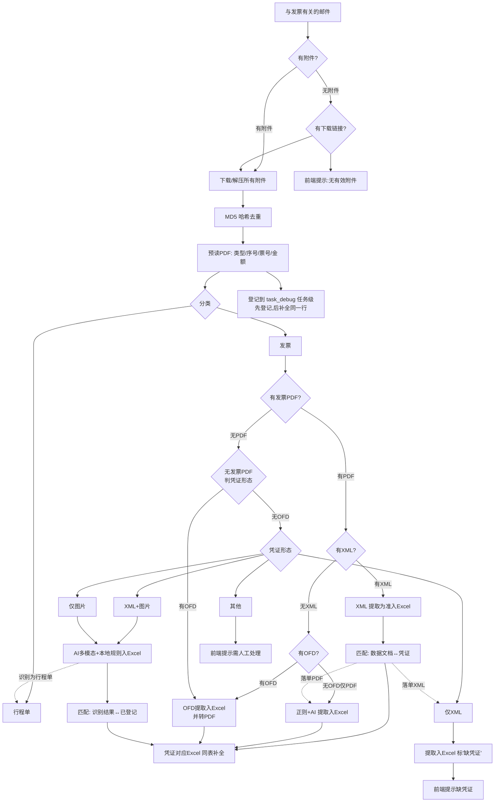
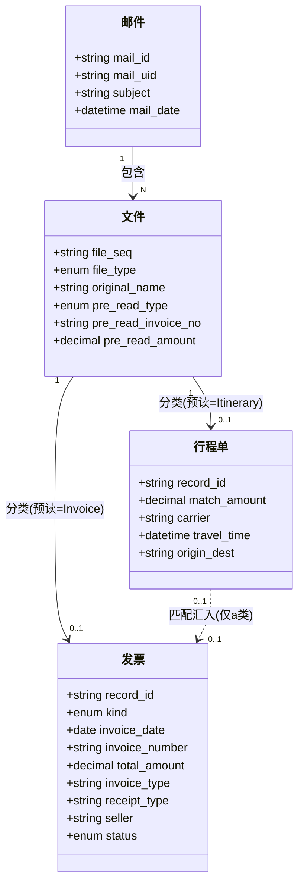
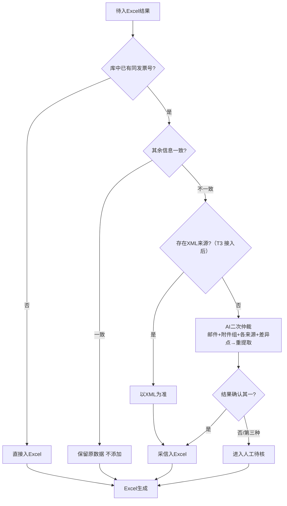

# 发票邮件处理系统 · 重构方案（3.0）

> 本文件是 3.0 重构的**总方案 + 契约锁定层**。它定义"目标 / 流程 / 数据模型 / 模块接口 / 验收"。
> 分工与任务清单见同目录《计划分工.md》。
> 任何参与重构的对话/开发，改动前必须先读本文件，**契约部分（第 3、4、5、6 节）冻结，不得擅自发明接口**。

---

## 1. 目标与范围

**T2 交付目标**：保留旧版已有的 PDF 发票、行程单及邮件附件处理能力，把"一封邮件整包处理"整理为可扩展的主循环，实现一发票一笔、行级来源、行程单匹配、写表前去重和差异化字段校验。旧版终版保存在项目根目录 `T1/`（Git 提交 `bfd6972`）；新版继续在项目根目录开发。

**阶段边界（2026-09-29 确认）**：XML/OFD 字段提取、图片多模态、邮件正文下载链接获取及 XML/OFD/PDF 跨格式凭证匹配属于 T3 后续功能。T2 为这些分支保留调度接口和文件登记/待核提示，不把"登记"当成"已提取"。T2-3～T2-6 保留在 T2。

已锁定的关键决策（来源：本重构评审）：

- **记录单位**：一发票 = 一笔
- **记录来源粒度**：行级来源（每条记录挂 来源邮件 + 来源文件）
- **行程单匹配锚点**：以 **报销金额（四舍五入，±容差）为首要匹配**，次以 **原文件名** 二次核对（**不是发票号码；销售方不参与自动配对**）
- **非目标**：不自动标已读、不做发票真伪、不长期存储邮件内容

---

## 2. 主处理流程

### 2.0 T2 实际交付流程



以下原主流程图保留为**T3 扩展后的目标流程参考**；图中的 XML/OFD/图片提取、下载链接和跨格式凭证匹配均不是 T2 交付或 T2-1 完成标准。T3 实施时再细化其规则。



### 关键分支
| 分支 | 条件 | 行为 |
|------|------|------|
| B/D | 附件 / 下载链接 | 有则下载解压；都无 → 前端提示"无有效附件" |
| F | MD5 去重 | 同邮件内重复只留一份；记 `dedup_skipped`，不展示 |
| G→K | 预读 | 只登记基础字段（类型/序号/票号/金额）；先入任务级"待补全"表 |
| M→N | 有 XML | 以 XML 结构化数据为准入 Excel |
| P→SS | 有 OFD | OFD 提字段入 Excel + 转 PDF 参与匹配 |
| P→Q | 仅纯 PDF 发票 | 正则 + AI 提取 |
| S | 无发票 PDF | 判凭证形态：有OFD / 仅XML / XML+图片 / 仅图片 / 其他 |
| U→Z | 仅 XML | 提取入 Excel，**标"缺凭证"** + 前端提示 |
| V/W→X | 含图片 | AI 多模态 + 本地规则校验（口径见 §2.1）|
| T→AB | 其他 | 前端提示需人工处理 |

**反向触发（虚线）**：图片识别为行程单 → 汇入 I；匹配后落单 XML → 回流 U；落单 PDF → 回流 Q。

### 2.1 本地规则校验（X 分支的硬性口径）
对「AI 多模态」解析结果做**规则校验**，判别可靠性（**非 AI，是确定性的硬规则**）：
- **发票号码**：必须符合位数/格式规则（20 位数字，已固化），不符合视为不可靠
- **报销金额**：必须为数字且 > 0，与"价税合计(小写)"一致，不带货币符号
- **发票日期**：必须符合 `YYYY-MM-DD`
- **校验结果**：命中规则 → 采信；未命中 → 降级走兜底 / AI 二次仲裁 / 人工待核

> 发票号码位数已固化为 20 位数字（本次评审确认）。

---

## 3. 数据模型（系统内部，4 类）

### 3.1 类图（契约）


> **a 类发票判定**：`行程类型ab == "a类"` 的发票即需行程单。判定依据为票面类型命中 `config.py::TRANSPORT_RECEIPT_KEYWORDS`（通行费 / 客运服务(费) / 代收通行费 / 运输服务费 / 网约车服务费 / 出租车服务费，对"费"字容错），子串关键词匹配。
> **字段归属（箭头方向即数据流向）**：`出行时间 / 出发地目的地` **从行程单发出 → 汇入 a 类发票**（行程单页提取；匹配成功后写入 a 类发票记录，再写输出 Excel）。`行程类型ab == "b类"` 的发票不涉及这两个字段。
> **字段命名**：`文件编号 = mail_id + 文件序号`（全局定位键）；`发票.报销金额 / 销售方` 与 `行程单.匹配金额 / 承运方` 分属两实体，互不重名。

### 3.2 输出给用户的 Excel 视图
- **只输出业务列**（不含内部列）：
  - b 类：发票日期、发票号码、报销金额、发票类型、票面类型、销售方
  - a 类：上述 + 出行时间、出发地/目的地
- **不输出**：文件序号、来源邮件、邮件时间、文件类型
- **行程单不单独成行**，命中后汇入 a 类发票行

### 3.3 `task_debug.json` 结构（契约基线）
每封邮件一个条目，内部记录：
```
{
  "mail_id": "Msg3",                # 邮件序号（业务）
  "mail_uid": "1747702802",         # IMAP UID（追源）
  "subject": "…",                   # 邮件主题
  "mail_date": "YYYY-MM-DD HH:mm",  # 邮件日期时间（分钟精度）
  "files": [ {
      "file_seq": "01",             # 文件序号
      "file_type": "PDF|XML|OFD|图片|其他",
      "original_name": "…",         # 原文件名
      "pre_read_type": "Invoice|Itinerary|Unknown",
      "pre_read_invoice_no": "…",   # 预读票号
      "pre_read_amount": 1264.0     # 预读金额
  } ],
  "records": [ {                    # 一笔 = 一条记录
      "record_id": "Msg3-01",
      "kind": "a类|b类",
      "fields": { "invoice_date":"YYYY-MM-DD", "invoice_number":"…",
                  "total_amount":1264.0, "invoice_type":"…", "receipt_type":"…",
                  "seller":"…", "travel_time":"…", "origin_dest":"…" },
      "source": { "source_file_seq": ["01"] },
      "matched_itinerary": { "file_seq":"02", "match_amount":53.93 },
      "status": "complete|缺凭证|人工待核"
  } ],
  "dedup_skipped": [ { "filename":"…", "reason":"…" } ],
  "error_reason": ""
}
```

### 3.4 `file_classifications` 契约（AI 返回）
- 数组长度 == 该邮件参与 AI 的文件数，顺序与输入一致
- 每项：`{"file": "<Msg{序号}_{文件序号}_{安全名>.pdf>", "role": "Invoice|Itinerary|Unknown"}`

---

## 4. 匹配与去重仲裁

### 4.1 数据文档 ↔ 凭证匹配（O / Y）
- **阶段归属：T3 单列任务。** T2 主循环仅预留接入位置；本节是后续目标规则，不作为 T2 验收项。
- XML、图片识别结果（数据侧）与 PDF/图片发票（凭证侧）靠 **发票号码** 建立对应
- 识别不出的走预读 / 本地规则锚点

### 4.2 行程单匹配（仅 a 类发票需要）
1. 单发票 + 单行程单 → 直接成组，无需匹配
2. 多对多时按优先级匹配：① 报销金额 → ② 原文件名。先比较金额精度，将精度较高者按精度较低者的小数位数四舍五入；若仍不相等，再比较**原始金额**差值，绝对值 ≤0.5 可列为金额候选。
3. 金额候选不唯一时必须用原文件名继续核对；仍无法唯一确定，或两级均未命中 → 进入人工待核。销售方仅作为人工待核时的参考线索，**不参与自动配对**。
4. 成功 → 汇入 出行时间 / 出发地目的地 到 a 类发票行

> 金额边界测试覆盖差值 0.49、0.50、0.51；0.50 属于容差内。金额相近不等于可直接自动配对，最终须唯一确定。

### 4.3 写 Excel 前去重仲裁（本轮结果集**内部**，不跨历史文件）

- **人工待核（K）**：记录**仍进 Excel**（`status` 标记为「人工待核」），前端额外引导用户去邮箱核对（提供邮件名 + 时间 + 文件序号）
- T2 仅对本轮已支持的 PDF 结果执行去重与仲裁；XML 来源优先的分支待 T3 XML 提取接入后启用。

---

## 5. 文件序号与来源定位（契约）

- **全局定位键**：`Msg{序号}-{文件序号}`，如 `Msg3-02`
- **邮件标识** `Msg{序号}`：本轮未读邮件按序编号；内部**缓存 IMAP UID** 保证追源稳定
- **文件序号** `01/02/03…`：该邮件下所有参与处理的文件统一编号（PDF直附件、ZIP内PDF、XML、图片、OFD 同一套，邮件内唯一），**与邮件双向可查**
- **存盘名**：`Msg{序号}_{文件序号}_{安全名}`，同名不覆盖；内容相同时只保留首份
- **规则：任何"文件序号"必须能反查到具体邮件 + 文件，不得只有序号无关联**

---

## 6. 字段校验（按凭证类型差异化）

**职责**：彻底消除旧代码"b 类被假报缺 出行时间/出发地"的误报。字段校验**以字段归属为边界**，不再全字段统一清单一刀切。

- `b类发票`：只校验 6 字段（日期/号码/金额/发票类型/票面类型/销售方），**不查** 出行时间/出发地
- `a类发票`：校验 8 字段，其中 出行时间/出发地目的地 **校验"是否已从行程单汇入"**，不是"发票自身是否有"
- `行程单`：校验 金额/销售方/出行时间/出发地目的地

**旧代码改动点（3 处）**：
1. `build_fallback_audit_result`：发票侧**去掉**抠 出行时间/出发地目的地 的逻辑
2. `_collect_not_found_alerts`：改为**仅 a 类 + 校验汇入**
3. `SUMMARY_COLUMNS` 写入时机：a 类两字段（出行时间、出发地/目的地）在行程单匹配后才汇入

---

## 7. 模块接口契约（冻结）

现有 `invoice_pipeline.py` 拆为 6~7 个模块，接口如下。**任何对话只实现自己的模块，import 已冻结的接口，不得改名/改签名。**

| 目标模块 | 对外接口（签名冻结） | 类别 |
|---------|---------------------|------|
| `config.py` | `RunConfig`(dataclass)；`safe_desktop_subfolder`；`_imap_error_hint`；`should_send_netease_id`；`ensure_output_dirs`；常量 `SUMMARY_COLUMNS`、`TRANSPORT_RECEIPT_KEYWORDS` | A |
| `utils.py` | `build_non_conflicting_path`；`format_amount_text`；`clean_receipt_type`；`format_travel_date_cn`；`format_invoice_date_cn`；`_normalize_date_text`；`clean_filename`；`decode_str`；`safe_parse_mail_date`；`sanitize_excel_date_display`；`zip_directory_to_bytes` | A |
| `type_classifier.py` | `classify_type_from_attachment_name`；`normalize_doc_role`；`_resolve_ai_role_for_file`；`collect_classification_mismatches` | B（T2 重写） |
| `fallback_extractor.py` | `build_fallback_audit_result` | A（微调，见§6-1） |
| `ai_client.py` | `call_ai_audit_and_rename`；`_rename_pdfs_with_audit`；skill prompt 外置 `prompts/audit_system.txt` | A |
| `excel_writer.py` | `append_to_summary_excel` | A |
| `attachment_processor.py` | 公共附件获取、ZIP 解压、MD5 去重、安全存盘、文件序号与格式登记；留下载链接获取接口 | B/C |
| `pipeline.py` | `run_pipeline(cfg, log)->(mismatches, stats)`（T2-1 主流程调度与记录组装） | C |

T2 的 PDF 提取、行程单匹配、去重仲裁、字段校验可从旧实现复制并改造为独立模块；T3 的 XML/OFD/图片提取及跨格式凭证匹配各有独立任务。建议文件名、调用边界与 Excel/来源链见《项目结构与任务边界.md》，模块内部新接口由对应任务提出并核对。旧版快照不修改。

**类别说明**：
- A：1:1 原样迁移（只改 import 路径，业务逻辑不改）→ 适合外包对话
- B：微调适配（改数据形态/落盘名，不改变量逻辑）
- C：逻辑重写（颠覆性，本对话把关）

---

## 8. 验收标准

- **阶段一（拆分）**：能用现有 demo（`app_demo.py` 未改）跑同一批邮件、结果与重构前一致（回归对照），即"拆文件未破坏原逻辑"。
- **阶段二（核心）**：旧版 PDF/行程单及附件能力在新框架中可用；一发票一笔、行程单金额匹配+原文件名核对、本轮去重仲裁、来源双向定位、b 类不误报、Excel 只输出业务列。XML/OFD/图片等未提取形态有登记与明确待核提示，不伪造发票记录。
- **阶段三（扩展）**：XML/OFD 提取、跨格式凭证匹配、图片多模态、下载链接获取及前端提示/来源展示适配；分别验收后才视为完整目标流程。

---

## 9. 待续拍板的技术边界
| # | 待定项 |
|---|--------|
| 1 | OFD 转换异常兜底（损坏/加密 → 保留原 OFD + 待核）的落点 |
| 2 | XML 提取字段全集 + "数据文档↔凭证"锚点的精确映射（需样例） |
| 3 | `出行时间` 取第一笔行程、出发地目的地取第一段的样例复核 |
| 4 | 图片本地规则校验口径 → 已确认，见 §2.1；票号位数=20 位已固化，正则口径待写死到 fallback_extractor.py |
| 5 | AI 二次仲裁 prompt 组装（各来源+差异点）句式 |
| 6 | 模型统一：文本模型(Generation.call) vs 多模态(MultiModalConversation.call) 的选取策略（归阶段三 T3-2） |
