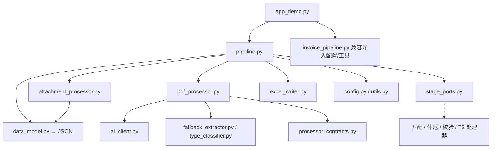

# 项目结构与任务边界

> 2026-10-01 文档修订；T2-1 已阶段交接，当前新决议的代码增量见《计划分工.md》§5。T2 保留 T2-1～T2-6，完成旧版能力在新框架中的适配、清理和重写；XML/OFD/图片识别、下载链接获取及跨格式凭证匹配后移 T3。表中标为“建议”的新文件名和模块内部接口由对应任务先提出并核对，尚未冻结。

## 1. 新旧版位置

- **旧版快照**：`T1/` 是 Git 提交 `bfd6972`（提交名 `T1-7`）的完整受版本管理文件副本。它保留原始目录结构，不随新版开发修改。
- **新版工作区**：继续使用项目根目录。现有 `pipeline.py` 是 T2-1 主干；`app_demo.py` 和 `invoice_pipeline.py` 已有在途改动，属于新版工作区，不能冒充 T1-7 旧版。
- 旧版的运行入口位于 `T1/app_demo.py`；新版运行入口仍为根目录 `app_demo.py`。从旧版借鉴逻辑时复制所需代码到新版文件后修改，禁止直接修改快照。
- 不将旧文件从根目录直接搬走：根目录现有模块仍是新版主干的依赖。待新版对应模块接管后，再决定根目录旧实现如何清理。

## 2. 业务执行顺序和两个易混淆的环节

```text
app_demo.py（前端入口）
  → pipeline.py::run_pipeline（T2-1 主循环）
  → attachment_processor.py（附件获取、ZIP、MD5、编号和登记）
  → PDF 提取等形态处理器（T2 先接 PDF；XML/OFD/图片在 T3 接入）
  → 凭证组合〔T2 仅保留入口；跨格式配对在 T3〕
  → 行程单匹配（T2-3）→ 本轮去重仲裁（T2-4）→ 字段校验（T2-6）
  → pipeline.py 组装业务行 → excel_writer.py::append_to_summary_excel 写 Excel
  → data_model.py::mail_to_dict 序列化 → pipeline.py 写 task_debug.json
```

**Excel 谁写？** `pipeline.py` 决定哪些发票记录入表、组装八个业务列并调用 `excel_writer.py`；真正创建/追加 `.xlsx` 的是 `excel_writer.py::append_to_summary_excel`。文件形态处理器不得直接写 Excel。

**来源双向定位在哪做？** `attachment_processor.py` 给邮件内每个保留文件分配 `file_seq`、安全存盘名并记录原文件名；`pipeline.py` 保留 `mail_id`/`mail_uid`，生成 `record_id=mail_id-file_seq`，把发票来源写入 `source.source_file_seq`，匹配行程单时记录其文件序号；`data_model.py` 将关系写进 `task_debug.json`。T2-5 检查和完善这条链，不能只靠 Excel 反查，因为用户 Excel 不含内部来源列。

## 3. 任务与根目录文件（建议，文件名未全部确认）

| 阶段/任务 | 文件 | 负责 | 边界 |
|---|---|---|---|
| T2-1 主循环 | `pipeline.py` | 收件、调度、组织一发票一笔结果、待核提示和输出；为后续形态留接口 | 不把 PDF/XML/OFD 提取、匹配和仲裁细则堆进主循环 |
| T2-2 数据模型（原阶段完成，新决议待适配） | `data_model.py` | 邮件、文件、发票、行程单关系和 JSON 序列化 | 不承载提取或匹配算法 |
| 公共附件处理，T2-5 完善来源 | `attachment_processor.py` | 直接附件、ZIP 解压、MD5 去重、文件序号、安全存盘及格式登记；预留链接获取入口 | 不提取各形态业务字段；ZIP 是容器，链接是获取方式 |
| PDF 处理（T2 旧能力适配） | `pdf_processor.py` | 单文件预读、分类、AI/正则提取并返回结果；新决议字段规则待适配 | 不收邮件、不写 Excel、不跨发票复制字段 |
| T2-3 发票↔行程单匹配 | 建议 `itinerary_matcher.py` | 金额精度、±0.5 候选、原文件名核对及旅行字段汇入 | 不配对 XML/OFD/PDF 凭证 |
| T2-4 写表前仲裁 | 建议 `dedup_arbitrator.py` | 本轮结果按票号去重、冲突仲裁及待核 | 不做附件 MD5 去重 |
| T2-5 来源双向定位 | `attachment_processor.py` + `pipeline.py` + `data_model.py` | 确保邮件 UID、文件序号、记录来源与落盘文件可双向追查 | 不另建一套编号器 |
| T2-6 差异化字段校验 | 建议 `field_validator.py` | a/b 类字段、格式和汇入状态校验 | 不负责从文件提取字段 |
| Excel 输出 | `excel_writer.py` | 按业务列生成或追加汇总表 | 不决定凭证如何配对 |
| T3 XML 处理 | 建议 `xml_processor.py` | 提取 XML 字段及异常，接入 T2-1 预留接口 | 不直接写 Excel |
| T3 OFD 处理 | 建议 `ofd_processor.py` | 提取 OFD 字段、转换供核查的 PDF，接入预留接口 | 配对规则到任务实施时细化 |
| T3 凭证匹配（单列任务） | 建议 `voucher_matcher.py` | XML/OFD/PDF 等跨格式凭证配对、交叉核验和来源合并 | 不负责发票↔行程单匹配 |
| T3 图片识别 | 建议 `image_processor.py` | 多模态提取和本地规则校验 | T2 只登记并提示暂不支持 |
| T3 下载链接获取 | 优先扩展 `attachment_processor.py`；复杂时再拆 | 从正文链接取得文件后送入统一附件处理链 | 不新增“链接”文件类型 |
| 其他文件 | `attachment_processor.py` + `pipeline.py` | 登记来源，提示人工处理 | 不伪造发票记录，不静默丢弃 |

现有 `config.py`、`utils.py`、`type_classifier.py`、`ai_client.py`、`fallback_extractor.py` 可供 T2 新模块借鉴或调用；需要改动时应先核对旧快照，保持旧版不变。`invoice_pipeline.py` 在新版根目录暂为兼容旧导入的过渡文件，后续不能成为第二个主循环。

## 4. T2 与 T3 的文档边界

- 《重构方案.md》以 **T2 可交付范围**为准：PDF 及旧能力的新框架适配、一发票一笔、行程单匹配、去重仲裁、来源定位、差异化字段校验。流程图中 XML/OFD/图片/下载链接的目标分支应明确标为 T3 预留，不能算 T2 已实现。
- 《计划分工.md》保留 T2-1～T2-6；T3-2 负责大模型接入改造，覆盖文本/多模态接口适配。XML、OFD、独立图片处理器、跨格式凭证匹配及下载链接的完整任务边界与新增编号待后续确认。
- T2-1 验收只证明主框架可调用处理器并能处理 PDF 旧能力；T3 的未实现文件形态应被登记并给出明确提示，不伪造提取结果。

## 5. 仍需确认

1. 建议的新模块文件名，以及是逐步从 `pipeline.py` 移出已写的逻辑，还是保留少量简单调度代码。
2. T3 各新增任务编号和具体配对规则。OFD↔PDF 的细节留到凭证匹配任务实施时定。
3. T2 对“其他”及 T3 暂未处理的文件，提示的具体用户文案。

## 6. 项目资料目录约定

- `01 docs/01 project/`：项目基础资料，包括 PRD、重构方案、任务分工、项目结构和运行说明。
- `01 docs/02 technical-design/`：相对稳定的技术设计资料，包括流程图、实体关系、字段表和 Excel 规则。
- `02 build/<任务号>/`：研发侧过程资料，包括实现说明、开发自测、阶段交接和研发决策。这里的测试代码服务于研发开发过程，不等同于测试工程师的独立验收。
- `03 tests/<任务号>/`：测试工程师侧资料，包括测试方案、测试设计、缺陷记录、自动化脚本和执行结果。
- `04 logs/`：运行调试日志，属于本地产物，不作为正式设计或验收结论。
- `T1/`：旧版快照，只读，不参与新版运行。

同一个任务号可以同时出现在 `02 build/` 和 `03 tests/`，但两边的职责不同：前者回答“研发实现了什么、如何自测和交接”，后者回答“测试如何验证、发现了什么、结果是什么”。

## 7. 根目录代码文件的当前口径

### 7.1 当前调用关系及后续接入

箭头表示调用或依赖，不代表固定文件数量。虚线为尚待实现的阶段接口。



主流程分别调用 Excel 写入与 JSON 序列化；excel_writer.py 不调用 data_model.py。T3 导出副本业务命名和新版页面适配由 T3-1 完成，不能以当前简单打包冒充目标导出。

### 7.2 当前后端主要模块

以下为新版后端主要模块；该分组仅便于阅读，不作为模块重要性或是否可删除的判据：

```text
pipeline.py
attachment_processor.py
pdf_processor.py
processor_contracts.py
data_model.py
stage_ports.py
excel_writer.py
```

`app_demo.py` 是前端入口；`config.py`、`utils.py`、`ai_client.py`、`fallback_extractor.py`、`type_classifier.py` 是核心处理所依赖的支撑模块；`invoice_pipeline.py` 是兼容过渡层；`convert_task_debug_v2.py` 是生产端历史数据转换/验证工具。是否可清理须核对实际引用与任务用途。

### 7.3 其他文件

原根目录中没有被新版运行链引用的临时分析、逆向分析文件，暂存于 `99 other/`，确认彻底无用后再删除。

新增、移动或清理文件时，按同目录的《项目目录与文件归档规则.md》执行；该文档维护目录用途、研发与测试资料的归属、AI 工程师归档检查步骤及各类文件的权威来源。

## 8. 本次决议的职责落点

业务规则统一以《重构方案.md》§3～6 为准：逐文件提取，完整保存行程单四字段；发票类型可空，票面类型判 a/b；票号/日期/金额全缺才不入表；单对单自动成组，其余按金额/原名；金额十进制最多四位、显示两位。
数据模型负责四字段 JSON 与名称映射，处理器负责单文件提取，匹配/校验模块负责各自规则，主流程最终筛选并写表，页面/导出负责用户提示和业务命名。内部编号名和用户导出名分离；完整原名不截断，实际存盘名最多 120 字符。
运行日志统一项目 04 logs/，测试证据日志随 result/。这些是修订后的目标；代码待办见《计划分工.md》§5。
