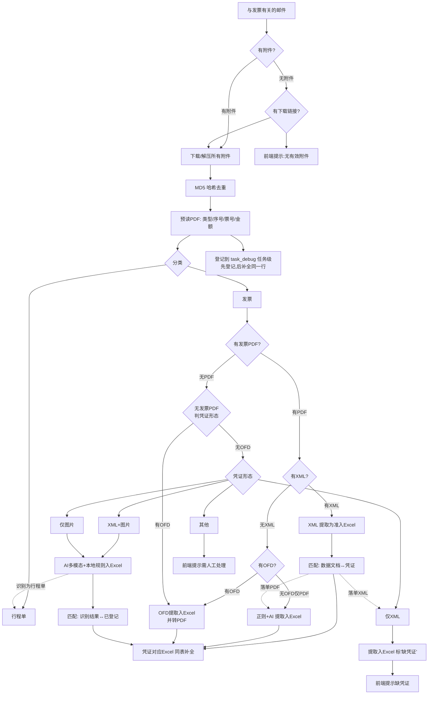
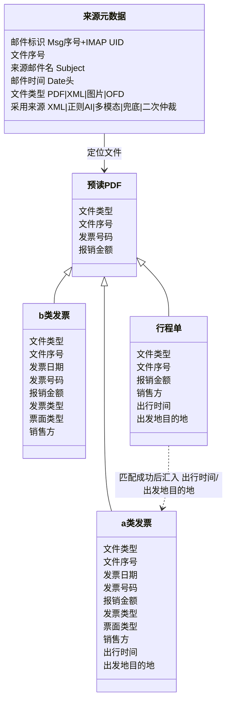
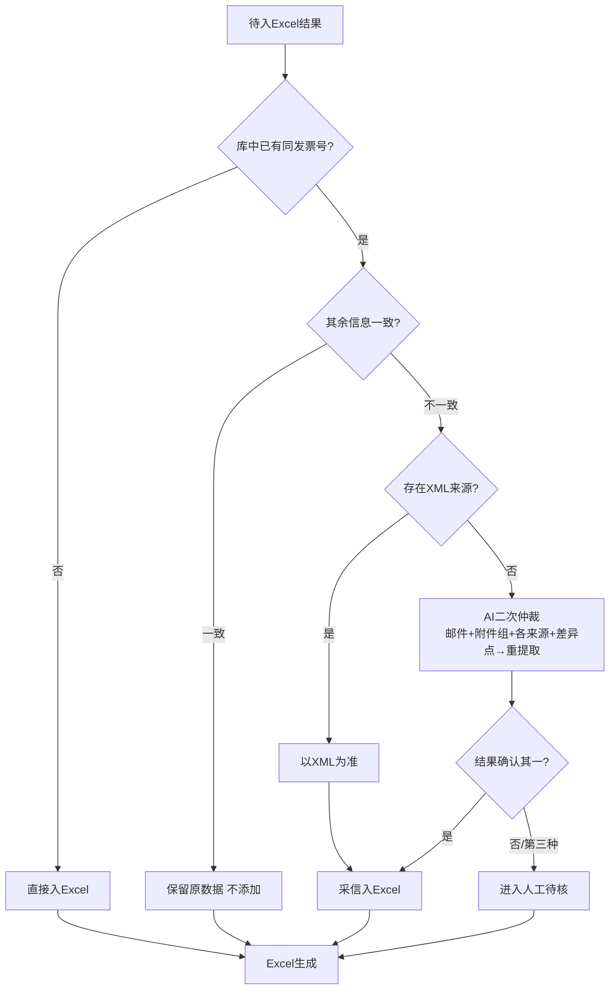

# 发票邮件处理系统 · 重构方案（3.0）

> 本文件是 3.0 重构的**总方案 + 契约锁定层**。它定义"目标 / 流程 / 数据模型 / 模块接口 / 验收"。
> 分工与任务清单见同目录《计划分工.md》。
> 任何参与重构的对话/开发，改动前必须先读本文件，**契约部分（第 3、4、5、6 节）冻结，不得擅自发明接口**。

---

## 1. 目标与范围

把现有"一封邮件整包处理"重构为 **「按凭证形态分流、一发票一笔记录」** 的模型，补齐 XML / OFD / 图片 / 多凭证组合能力，并建立「文件序号 ↔ 邮件」双向定位。

已锁定的关键决策（来源：本重构评审）：

- **记录单位**：一发票 = 一笔
- **记录来源粒度**：行级来源（每条记录挂 来源邮件 + 文件 + 采用来源）
- **行程单匹配锚点**：以 **报销金额（四舍五入，±容差）为首要匹配**，命中后 **销售方** 二次核对（**不是发票号码**）
- **非目标**：不自动标已读、不做发票真伪、不长期存储邮件内容

---

## 2. 主处理流程



### 关键分支
| 分支 | 条件 | 行为 |
|------|------|------|
| B/D | 附件 / 下载链接 | 有则下载解压；都无 → 前端提示"无有效附件" |
| F | MD5 去重 | 同邮件内重复只留一份；记 `dedup_skipped`，不展示 |
| G→K | 预读 | 只登记基础字段（类型/序号/票号/金额）；先入任务级"待补全"表 |
| M→N | 有 XML | 以 XML 结构化数据为准入 Excel |
| P→SS | 有 OFD | OFD 提字段入 Excel + 转 PDF 参与匹配 |
| P→Q | 仅纯 PDF 发票 | 正则 + AI 提取 |
| S | 无发票 PDF | 判凭证形态：有OFD / 仅XML / XML+图片 / 仅图片 / 其他 |
| U→Z | 仅 XML | 提取入 Excel，**标"缺凭证"** + 前端提示 |
| V/W→X | 含图片 | AI 多模态 + 本地规则校验（口径见 §2.1）|
| T→AB | 其他 | 前端提示需人工处理 |

**反向触发（虚线）**：图片识别为行程单 → 汇入 I；匹配后落单 XML → 回流 U；落单 PDF → 回流 Q。

### 2.1 本地规则校验（X 分支的硬性口径）
对「AI 多模态」解析结果做**规则校验**，判别可靠性（**非 AI，是确定性的硬规则**）：
- **发票号码**：必须符合位数/格式规则（如 20 位数字、起止标志位可按真实票样确定），不符合视为不可靠
- **报销金额**：必须为数字且 > 0，与"价税合计(小写)"一致，不带货币符号
- **发票日期**：必须符合 `YYYY-MM-DD`
- **校验结果**：命中规则 → 采信；未命中 → 降级走兜底 / AI 二次仲裁 / 人工待核

> 具体正则与位数以真实票样（电票 PDF / 图片样例）复核后固化，见《计划分工》T3-2 配套。

---

## 3. 数据模型（系统内部，5 类）

### 3.1 类图（契约）


> **a 类发票判定**：票面类型 ∈ {通行费, 客运服务费, 代收通行费}。
> **字段归属（箭头方向即数据流向）**：`出行时间 / 出发地目的地` **从行程单发出 → 汇入 a 类发票行**（行程单页提取这三个字段；匹配成功后写入 a 类发票记录，再写输出 Excel）。b 类不涉及这两个字段。

### 3.2 输出给用户的 Excel 视图
- **只输出业务列**（不含内部列）：
  - b 类：发票日期、发票号码、报销金额、发票类型、票面类型、销售方
  - a 类：上述 + 出行时间、出发地/目的地
- **不输出**：文件序号、来源邮件、邮件时间、文件类型、采用来源
- **行程单不单独成行**，命中后汇入 a 类发票行

### 3.3 `task_debug.json` 结构（契约基线）
每封邮件一个条目，内部记录：
```
{
  "mail_id": "Msg3",           # 邮件标识
  "subject": "…",              # 来源邮件名
  "mail_date": "YYYY-MM-DD",   # 邮件时间（Date头）
  "files": [ {文件序号, 文件类型, 原文件名, 存盘路径, 预读类型, 预读票号, 预读金额, MD5} ],
  "records": [ {               # 一笔 = 一条记录
       "record_id": "Msg3-01",
       "kind": "a类发票|b类发票",
       "fields": {…发票字段…},
       "source": {"采用来源":"XML|正则AI|…", "来源文件序号":["…"]},
       "matched_itinerary": {"文件序号":"…", "匹配金额":…, "销售方核对":"ok/fail"},
       "status": "complete|缺凭证|人工待核"
  }],
  "dedup_skipped": [ {filename, md5, reason} ],
  "error_reason": ""
}
```

### 3.4 `file_classifications` 契约（AI 返回）
- 数组长度 == 该邮件参与 AI 的文件数，顺序与输入一致
- 每项：`{"file": "<Msg{序号}_{文件序号}_{安全名>.pdf>", "role": "Invoice|Itinerary|Unknown"}`

---

## 4. 匹配与去重仲裁

### 4.1 数据文档 ↔ 凭证匹配（O / Y）
- XML、图片识别结果（数据侧）与 PDF/图片发票（凭证侧）靠 **发票号码** 建立对应
- 识别不出的走预读 / 本地规则锚点

### 4.2 行程单匹配（仅 a 类发票需要）
1. 报销金额（四舍五入，±容差）匹配到程单
2. 命中后销售方二次核对
3. 成功 → 汇入 出行时间 / 出发地目的地 到 a 类发票行

### 4.3 写 Excel 前去重仲裁（本轮结果集**内部**，不跨历史文件）

- **人工待核（K）**：**不进 Excel**，前端引导用户去邮箱查（提供邮件名 + 时间 + 文件序号）

---

## 5. 文件序号与来源定位（契约）

- **全局定位键**：`Msg{序号}-{文件序号}`，如 `Msg3-02`
- **邮件标识** `Msg{序号}`：本轮未读邮件按序编号；内部**缓存 IMAP UID** 保证追源稳定
- **文件序号** `01/02/03…`：该邮件下所有参与处理的文件统一编号（PDF直附件、ZIP内PDF、XML、图片、OFD 同一套，邮件内唯一），**与邮件双向可查**
- **存盘名**：`Msg{序号}_{文件序号}_{安全名}`，同名不覆盖；MD5 去重也在此层
- **规则：任何"文件序号"必须能反查到具体邮件 + 文件，不得只有序号无关联**

---

## 6. 字段校验（按凭证类型差异化）

**职责**：彻底消除旧代码"b 类被假报缺 出行时间/出发地"的误报。字段校验**以字段归属为边界**，不再全字段统一清单一刀切。

- `b类发票`：只校验 6 字段（日期/号码/金额/发票类型/票面类型/销售方），**不查** 出行时间/出发地
- `a类发票`：校验 8 字段，其中 出行时间/出发地目的地 **校验"是否已从行程单汇入"**，不是"发票自身是否有"
- `行程单`：校验 金额/销售方/出行时间/出发地目的地

**旧代码改动点（3 处）**：
1. `build_fallback_audit_result`：发票侧**去掉**抠 出行时间/出发地目的地 的逻辑
2. `_collect_not_found_alerts`：改为**仅 a 类 + 校验汇入**
3. `SUMMARY_COLUMNS` 写入时机：a 类三字段在行程单匹配后才汇入

---

## 7. 模块接口契约（冻结）

现有 `invoice_pipeline.py` 拆为 6~7 个模块，接口如下。**任何对话只实现自己的模块，import 已冻结的接口，不得改名/改签名。**

| 目标模块 | 对外接口（签名冻结） | 类别 |
|---------|---------------------|------|
| `config.py` | `RunConfig`(dataclass)；`safe_desktop_subfolder`；`_imap_error_hint`；`should_send_netease_id`；`ensure_output_dirs`；常量 `SUMMARY_COLUMNS`、`TRANSPORT_RECEIPT_KEYWORDS` | A |
| `utils.py` | `build_non_conflicting_path`；`format_amount_text`；`clean_receipt_type`；`format_travel_date_cn`；`format_invoice_date_cn`；`_normalize_date_text`；`clean_filename`；`decode_str`；`safe_parse_mail_date`；`sanitize_excel_date_display`；`zip_directory_to_bytes` | A |
| `type_classifier.py` | `classify_type_from_attachment_name`；`merge_type_from_name_and_local`；`resolve_effective_type_for_rename`；`triple_type_disagreement`；`normalize_doc_role`；`_resolve_ai_role_for_file`；`collect_classification_mismatches` | A |
| `fallback_extractor.py` | `build_fallback_audit_result` | A（微调，见§6-1） |
| `ai_client.py` | `call_ai_audit_and_rename`；`_rename_pdfs_with_audit`；skill prompt 外置 `prompts/audit_system.txt` | A |
| `excel_writer.py` | `append_to_summary_excel` | A |
| `attachment_processor.py` | 【新】预读、PDF/ZIP/图片/OFD 处理、MD5 去重、文件序号分配 | B/C |
| `pipeline.py` | `run_pipeline(cfg, log)->(mismatches, stats)`（主流程重组） | C |

**类别说明**：
- A：1:1 原样迁移（只改 import 路径，业务逻辑不改）→ 适合外包对话
- B：微调适配（改数据形态/落盘名，不改变量逻辑）
- C：逻辑重写（颠覆性，本对话把关）

---

## 8. 验收标准

- **阶段一（拆分）**：能用现有 demo（`app_demo.py` 未改）跑同一批邮件、结果与重构前一致（回归对照），即"拆文件未破坏原逻辑"。
- **阶段二（核心）**：新流程跑通——凭证形态分流正确、一发票一笔、行程单金额匹配+销售方核对生效、b 类不再误报、Excel 只输出业务列。
- **阶段三（前端/模型）**：人工待核入口、缺凭证提示、来源展示可用；多模态/文本模型兼容。

---

## 9. 待续拍板的技术边界
| # | 待定项 |
|---|--------|
| 1 | OFD 转换异常兜底（损坏/加密 → 保留原 OFD + 待核）的落点 |
| 2 | XML 提取字段全集 + "数据文档↔凭证"锚点的精确映射（需样例） |
| 3 | `出行时间` 取第一笔行程、出发地目的地取第一段的样例复核 |
| 4 | ~~图片本地规则校验口径~~ → 已确认，见 §2.1；待以真实票样固化票号正则/位数 |
| 5 | AI 二次仲裁 prompt 组装（各来源+差异点）句式 |
| 6 | 模型统一：文本模型(Generation.call) vs 多模态(MultiModalConversation.call) 的选取策略（归阶段三 T3-2） |